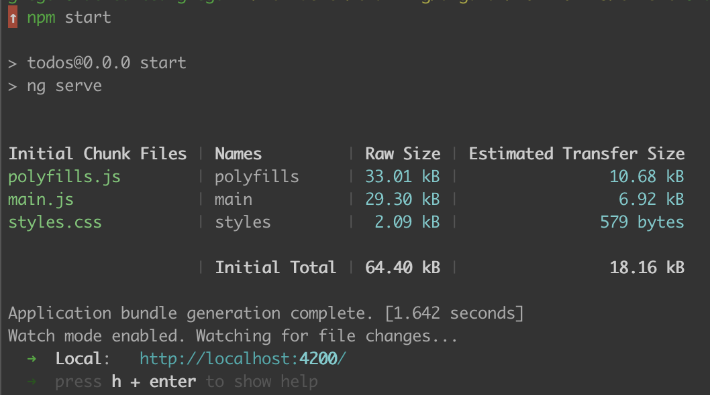
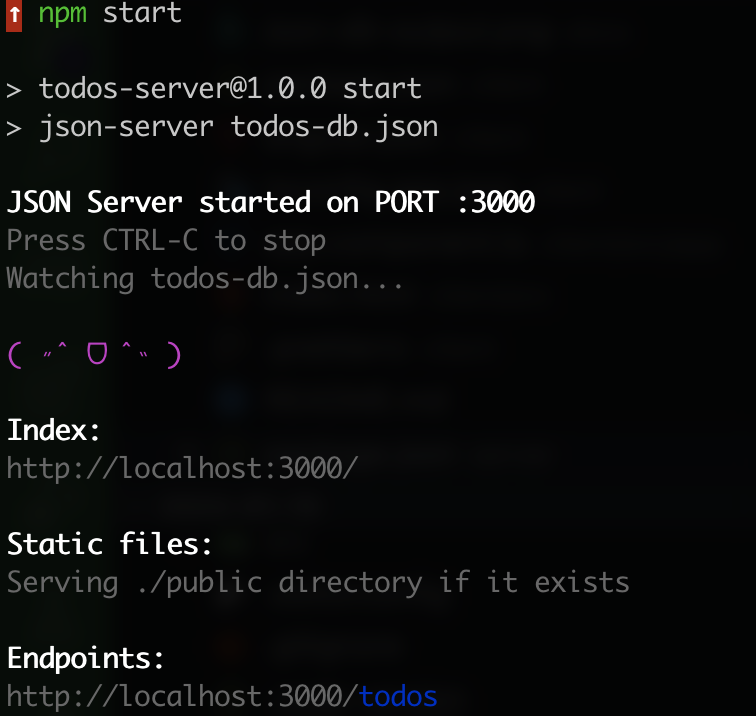

## Angular Solid Foundations

Hello 👋,

we are thrilled to meet you at our training.
Please find your personal preparation guide below.
It helps you to set up your development environment.

If you have any trouble, please don't hesitate to contact [Gregor].

Kind Regards
[Gregor]

[gregor]: https://twitter.com/gregonnet

## Prerequisites

### Code

Please clone this repository to your system and install the needed
dependencies for the Angular application and the Demo-Backend.

```bash
# Download repository
git clone https://github.com/ng-practice/2024-01-19.git workshop

# Switch into repository directory
cd workshop

# Install dependencies for Angular application
cd client/
npm install

# Install dependencies for Backend
cd server/
npm install
```

Please verify that both angular application and backend run on your system.

**Angular**

> Hint you can exit the development web server hitting <kbd>CTRL</kbd>+<kbd>C</kbd>.

```bash
cd client
npm start
```


_The output of a successfully started Angular application_

**Backend**

> Hint you can exit the development web server hitting <kbd>CTRL</kbd>+<kbd>C</kbd>.

```bash
cd server
npm start
```


_The output of a successfully started backend_

📖️ Please see the [server README](./server/README.md) for an API documentation.
